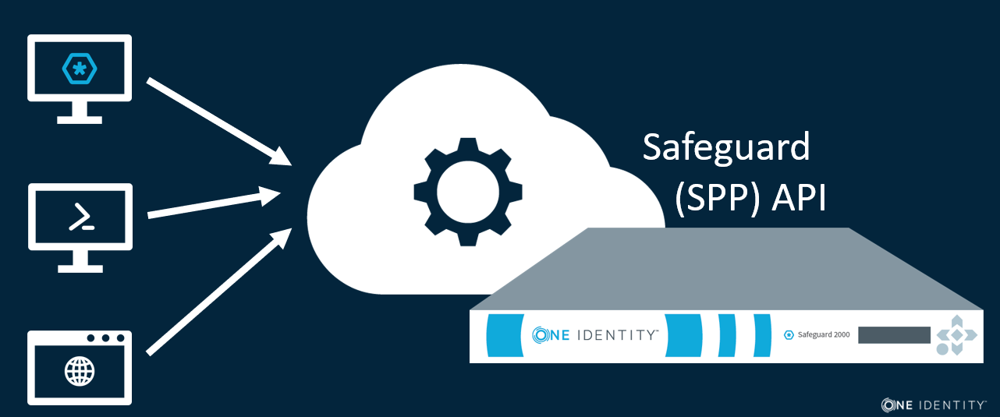
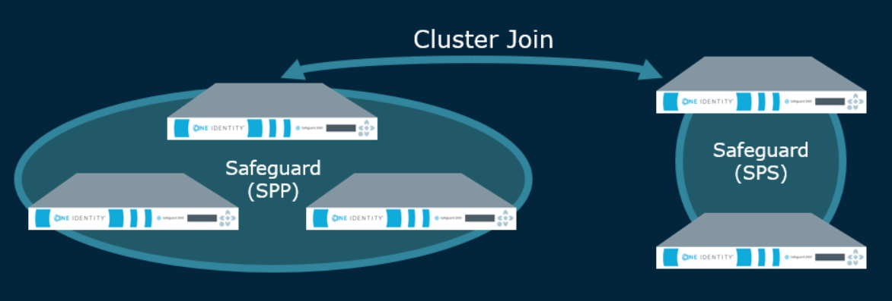
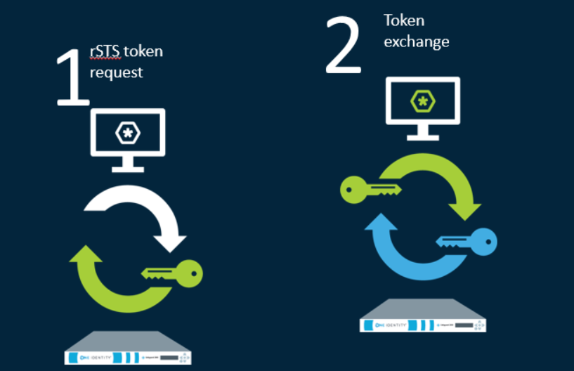

# SPP 1 -- Introduction to the Safeguard API

Safeguard for Privileged Passwords (SPP) is built as a secure, hardened
appliance to provide protection for passwords and private keys. In addition to
storing these credentials, SPP automates the management of the credentials in
the environment, which helps regulatory compliance and security. To access
passwords, private keys, and sessions, SPP provides a role-bashed policy model
and access request workflow. SPP maintains and indelible audit log of all
details of credential access, credential management, and configuration changes.

Because it is a secure, hardened appliance, all of the functionality of SPP is
exposed only through the Safeguard API. There is no direct console access.
There are no backdoors. There no special internal interfaces that only One
Identity can use. All of the functionality that you see in the SPP UI is
presented based on interactions with the Safeguard API.



This means that there is nothing that you cannot do with the Safeguard API
that you can do in the SPP UI.

## Clusters

SPP is delivered as an appliance, which can cause people to think that the
appliance is the product. In reality, SPP is almost never deployed as a single
appliance. In fact, One Identity very much recommends that you only deploy SPP
as a cluster of three or five appliances. The reason for this is that the SPP
application is actually served as a cluster. All of the appliances is in the
cluster have all of the data. The most critical services such as access request
workflow, credential management, and auditing are provided from every appliance
in the cluster. There is a primary appliance that is used for making
configuration changes, but any appliance in the cluster can be modified to
assume the primary role.


When thinking of SPP product functionality, it is important to think of it as
a highly available, redundant, fully consistent cluster solution rather than a
purpose-built 1U appliance sitting in your data center.

SPP clusters are also built to work with Safeguard for Privileged Sessions
(SPS) appliances and clusters. SPP and SPS clusters can be joined together to
allow SPP access request workflow and credentials to be used with SPS sessions.



SPP and SPS actually do not share a single Safeguard API. Each product has a
separate Safeguard API. They differ in authentication, versioning scheme, and
API basic endpoint design. In the future SPP and SPS will share a single
authentication strategy. There will always be differences between SPP and SPS
Safeguard APIs, but over time they will become more alike.

## Virtual Appliances

SPP provides hardware and virtual appliances. SPP hardware appliances and SPP
virtual appliances do not cluster together. The reason for this is that the
hardware version of SPP is the most secure embodiment of SPP. It is secured in
such a way that it isn't even vulnerable to the administrators who install it.
Not even One Identity can break into a hardened SPP hardware appliance. The
same is not true of SPP virtual appliances. It is not possible to completely
secure SPP virtual appliances from the administrators who control the
hypervisor where it is deployed. These hypervisor administrators have direct
access to the virtual disks and virtual memory of a running SPP virtual
appliance. However, there are some best practices for securing an SPP virtual
appliance cluster.


## Authenticating to the Safeguard API

SPP includes a secure token service (STS) that is actually a redistributable
component that appears in other One Identity products. This redistributable
secure token service (rSTS) handles the initial authentication to SPP. It
handles a wide variety of identity providers and authentication mechanisms.
SPP supports everything from local authentication using a local SPP user to
Active Directory users to federated IDPs and FIDO2. It supports RADIUS,
smart cards, and also 2FA via multiple mechanisms.

Authenticating to use the Safeguard API is a two step process. The initial
authentication is against the rSTS which results in an rSTS token (JWT). This
rSTS token is then exchanged for a Safeguard API token.



rSTS authentication uses OAuth 2.0. Our rSTS supports several different grant
types. **Authorization code grant** is used by the SPP desktop UI, the `-Gui`
parameter in safeguard-ps, and SafeguardDotNet.GuiLogin. **Implicit grant** is
used by the SPP web UI. **Resource owners grant** is used by most of our open
source projects such as safeguard-ps, safeguard-bash, SafeguardJava, and
SafeguardDotNet.

rSTS tokens and Safeguard API tokens are JWT bearer tokens. These tokens are
embedded in the HTTP Authorization header of the HTTP requests that are sent
to the Safeguard API.

```
Authorization: Bearer <token>
```

## Safeguard API Services

