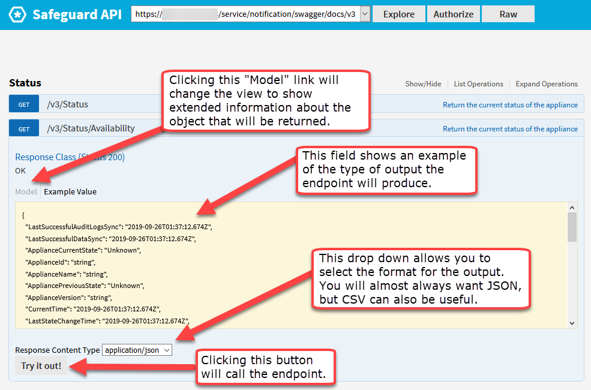
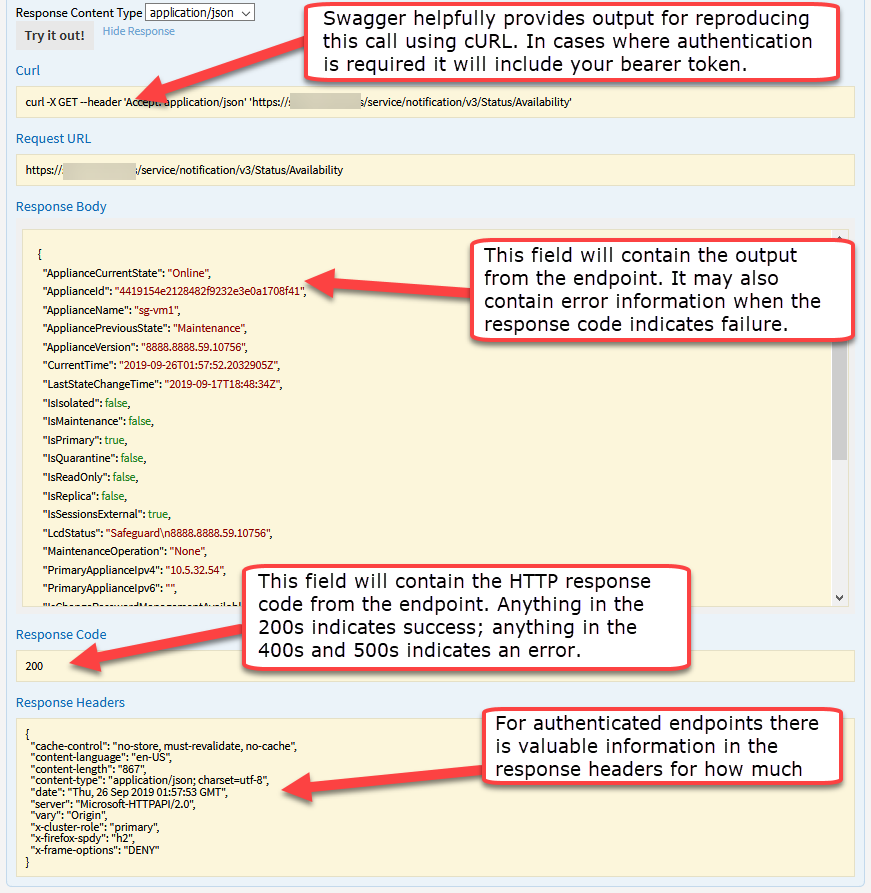

# Swagger UI Hands-on Lab

## 1. Find the Swagger OpenAPI file

To access the Swagger OpenAPI file use a browser to navigate to:

`https://<address>/service/<service>/swagger/docs/v3`

- Replace `<address>` with your appliance network address or DNS name.
- Replace `<service>` with one of `core`, `appliance`, or `notification`.

When you open this URL you will see a very large JSON document. This JSON
document describes the Safeguard API. This JSON document is far too large to
try to understand. Besides it is minified making it nearly impossible to read.

If you opened the URL with Chrome or Firefox, your browser will automatically
parse and format this huge JSON file so you can see the basic structure.

You can see that as of this writing (SPP 2.10) the Safeguard API is using the
Swagger or OpenAPI specification version 2.0.

Expanding the `paths` node in Firefox or another JSON document parser will show
all of the endpoints published for this service in the Safeguard API.

Expanding an individual path will show the HTTP methods that are available for
that path, e.g. `get`, `post`, `put`, `delete`. These methods correspond with
standard data manipulation verbs (CRUD):

  - `post` = `create`
  - `get` = `read`
  - `put` = `update`
  - `delete` = `delete`

The exception to this rule is that the HTTP `post` method is overloaded in
several places in the Safeguard API to perform a `post` action, when that
particular action does not fit neatly into CRUD semantics. In these cases the
path to that endpoint will end in a verb rather than a noun.

For example, `post` `service/core/v3/AccessRequests/{id}/Deny` is a `post`
action, whereas `post` `service/core/v3/AccessRequests` is a `create` action.

Expanding the `definitions` node will show all of the data transfer objects
(DTOs) that are published for this service in the Safeguard API. DTOs are the
data representations that are passed back and forth from REST APIs.

## 2. Find Swagger UI

Let's start by looking at the `notification` service.

To access the Swagger UI use a browser to navigate to:

`https://<address>/service/<service>/swagger`

But replace `<service>` with `notification`. Your browser will be automatically redirected to:

`https://<address>/service/<service>/swagger/ui/index`

Sometimes Swagger UI can take a significant amount of time to load, especially
with the `core` service. `notification` should load very quickly. Once the page
loads, you will see a long list of top-level endpoints that are hosted by the
service.

## 3. Calling the notification service -- anonymous GET

Click on `Status` to expand that endpoint to reveal the endpoints that are
available beneath it. Then, click again on `GET /v3/Status/Availability`.
This will expand to reveal an HTML form that allows you to interact with the
selected endpoint.

The top portion of the form contains a field that will show an example of the
type of output the endpoint will produce. There is a link to `Model` which will
switch to a view that gives detailed information about the object properties in
the `Example Value`. The drop down next to `Response Content Type` will allow
you to select a different type of output. Usually, `application/json` is the
most useful output, but for reporting use cases `text/csv` is also very
helpful.

Click on the `Try it out!` button to call the `GET /v3/Status/Availability`
endpoint. Swagger UI will issue an HTTP GET request on to the server. The HTML
form will expand to show the resulting output from the HTTP response.

The `Response Body` field will have your output. The `Response Code` will
indicate whether the call was successful. Anything in the 200s is success, but
but anything in the 400s or 500s is a failure. Most of the time failures will
include additional information in the `Response Body` field. The
`Response Headers` can be useful for authenticated requests. They will include
a header that tells you how much time is left on your Safeguard API token.

## 4. Authenticate to Safeguard using Swagger UI

## 5. Understanding the Swagger UI interface

## 6. Calling the core service -- GET users

## 7. Calling the core service -- POST create a user

## 8. Calling the appliance service -- GET support bundle

