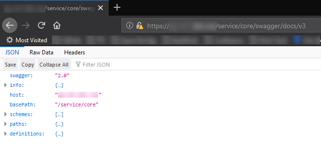

# Swagger UI Hands-on Lab

## 1. Find the Swagger OpenAPI file

To access the Swagger OpenAPI file use a browser to navigate to:
`https://<address>/service/<service>/swagger/docs/v3`

- Replace `<address>` with your appliance network address or DNS name.
- Replace `<service>` with one of `core`, `appliance`, or `notification`.

When you open this URL you will see a very large JSON document. This JSON
document describes the Safeguard API. This JSON document is far too large to
try to understand. Besides it is minified making it nearly impossible to read.

If you opened the URL with Chrome or Firefox, your browser will automatically
parse and format this huge JSON file so you can see the basic structure.

You can see that as of this writing (SPP 2.10) the Safeguard API is using the
Swagger or OpenAPI specification version 2.0.

Expanding the `paths` node in Firefox or another JSON document parser will show
all of the endpoints published for this service in the Safeguard API.

Expanding an individual path will show the HTTP methods that are available for
that path, e.g. `get`, `post`, `put`, `delete`. These methods correspond with
standard data manipulation verbs (CRUD):
    - `post` = `create`
    - `get` = `read`
    - `put` = `update`
    - `delete` = `delete`

The exception to this rule is that the HTTP `post` method is overloaded in
several places in the Safeguard API to perform a `post` action, when that
particular action does not fit neatly into CRUD semantics. In these cases the
path to that endpoint will end in a verb rather than a noun.

For example, `post` `service/core/v3/AccessRequests/{id}/Deny` is a `post`
action, whereas `post` `service/core/v3/AccessRequests` is a `create` action.

Expanding the `definitions` node will show all of the data transfer objects
(DTOs) that are published for this service in the Safeguard API. DTOs are the
data representations that are passed back and forth from REST APIs.

## 2. Find Swagger UI

To access the Swagger UI use a browser to navigate to:
`https://<address>/service/<service>/swagger`

## 3. Calling the notification service -- anonymous GET

## 4. Authenticate to Safeguard using Swagger UI

## 5. Understanding the Swagger UI interface

## 6. Calling the core service -- GET users

## 7. Calling the core service -- POST create a user

## 8. Calling the appliance service -- GET support bundle

