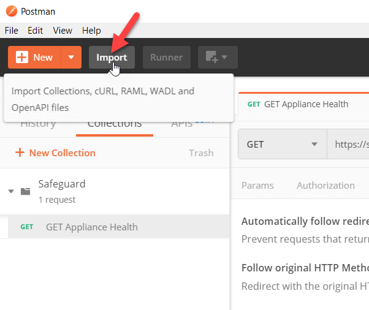
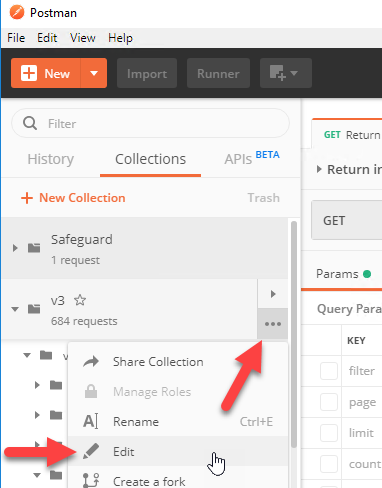

# Postman Hands-on Lab

## 1. Download and install Postman

First, you need to download [Postman](https://www.getpostman.com/downloads/).

Click on the Download button from the menu and select 64-bit.

Run the installer after it downloads.

Postman should start automatically, but if it doesn't load it from the Windows
start menu or the desktop icon.

You will be presented with a sign-in form. You can choose to sign into Postman
either by creating an account or signing in with your Google account.

If you don't want to log in or create an account, there is a link to skip login
at the bottom of the sign-in screen.

If you decide to use Postman extensively in the future, I recommend creating an
account so that your Postman Collections will be synchronized across devices.

## 2. Make a simple unauthenticated request

After the login screen, you will be shown the Create New screen. The first
thing we are going to do is make a simple request to SPP.

Click on the `Request` button under `BUILDING BLOCKS`.

Give the new request a name: `GET Appliance Health`.

Give the new request a description: `Get Safeguard appliance health from appliance service`.

Click on the `Create Collection` link to create a new Postman Collection.

Call the new Postman Collection `Safeguard`.

Click the check mark to save the `Safeguard` collection.

Click on `Save to Safeguard` to finish creating your new request.

Then, you need to fill out the request with a URL: `https://<address>/service/appliance/v3/ApplianceStatus/Health`
but replacing `<address>` with your appliance network address or DNS name.

Before you click the `Send` button to send the request, you probably need to
disable SSL verification. If you do, go to `File -> Settings` and turn off the
toggle next to `SSL certificate verification`.

Then, go back and click on the `Send` button.

This should result in a successful query of the appliance health. You will
will notice that you get pretty-printed JSON, and you can collapse elements of
it for better visibility in analyzing the response.

## 3. Import directly from Safeguard OpenAPI file

Now is a good time to take a minute to understand the Postman interface and
Postman Collections a little better. In the Postman interface, open requests
show up in tabs across the top of the UI. You can edit and save open requests
back to your collection.

Click on the `Save` button to save the `GET Appliance Health` request that you
created in the previous step.

In the pane on the left there are two tabbed views: `History` and
`Collections`. `History` shows any requests that you have run in you Postman
workspace. You can clear your `History` at any time, but you can also reload
a request from there into a new tab even after you have modified it in your
current tab.

Switching over to the `Collections` tab, you should be able to see the one
request hat you have saved thus far: `GET Appliance Health` inside the
`Safeguard` collection.

When looking at the an individual request tab, lower down on the form there is
an additional row of tabs that allow you to set different attributes of the
request. This is where you would go to set parameters, fill in the request
body, or modify request headers.

With the method that we showed in step 2 of this lab, you have to create each
individual request that you want to call. There is actually an easier way to
do this, but the easier method has its own drawbacks.

You can actually import all of the requests from an entire service in one shot
by downloading the OpenAPI file and importing it into Postman.

First, you need to open a browser and navigate to:

`https://<address>/service/<service>/swagger/docs/v3`

To get the OpenAPI file for a given service. Let's choose the `core` service,
because it is the biggest and has the most examples of different types of
Safeguard API endpoints.

When the OpenAPI file is loaded in the browser as a giant document, you should
be able to right-click in Chrome to `Save as` or in Firefox you can click the
`Save` button in the upper left of the view.  Once you have the file saved as
`v3.json`. You will be able to import it into Postman.

When the Import form pops up click on the `Choose Files` button.

Select the `v3.json` file that you downloaded.

There is kind of a weird user experience after you select the `v3.json` file
where it doesn't seem like the dialog is responding, but then it will close and
send you back to the main Postman view. After a few seconds a little pop up
will appear in the lower right corner saying that the file was imported.

If you go back to the `Collections` tab in the left pane and expand the `v3`
node, you will see that the entire `core` service has been imported into
Postman.

Take a moment to to browser through all of the endpoints that have been loaded
into Postman. This is the entire content of what you saw in the Swagger UI.
There are a couple of issues with using these endpoints directly, but they can
serve as a very good starting point with a little modification.

- For some reason Postman imports these with all of the query parameters turned
  on and filled out with bogus sample values. You will need to turn these off
  by unchecking the boxes.
- The body is assumed to be application/x-www-form-urlencoded which means the
  `Content-type` header needs to be changed to application/json.
- On the body tab the attributes that need to be encoded as JSON are there, but
  in order to actually send them you need to switch to `raw` and change the
  `Text` drop down to `JSON`. You will need to craft the JSON yourself.
- Most Safeguard API endpoints actually require authorization so you will need
  to learn how to create a Safeguard API token and save it in a variable. You
  will learn this later on in this lab.

Once you have made changes to a request you can save it back to the imported
collection or you can use `Save as` to save it to a different collection. You
will do this later on in this lab to add to the `Safeguard` collection we
created earlier.

Another thing you will notice about these imported requests is that the URL
does not contain an appliance IP address or DNS name. Instead it contains the
string `{{baseUrl}}`. This is a variable. Using such a variable is a really
good idea because it allows you to switch the context of the entire collection
to call a different appliance just by changing one value.

To see the `baseUrl` variable, select your `v3` collection in the left pane and
click on the three dots `...`. Select the `Edit` option. On the next form click
on the `Variables` tab.

On this view, you can change the `CURRENT VALUE` of the variable which is what
will be sent to replace `{{baseUrl}}` in any of the requests in this
collection. You could actually modify `baseUrl` to include `{{server}}` which
would allow you to create another variable called `server` with just the IP
address or DNS name of the target appliance.

Before moving, you should rename your `v3` collection to `core`. You can do
this on the `EDIT COLLECTION` view, or by selecting it in the left pane of the
main page, clicking on the three dots `...`, and selecting the `Rename` option.

## 4. Import a starter collection for authentication

## 5. Building and running a saved query

## 6. Building and running a saved collection
