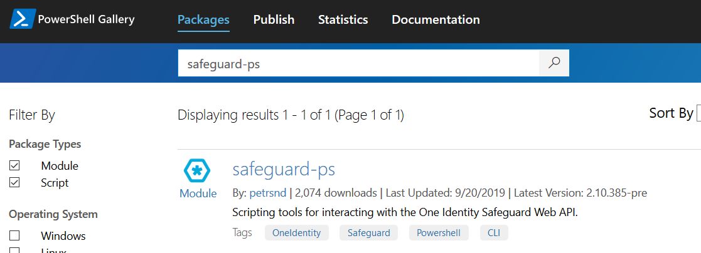

# safeguard-ps Hands-on Lab

## 1. Install safeguard-ps from the PowerShell Gallery

safeguard-ps is hosted on the PowerShell Gallery.

Open a browser, navigate to `powershellgallery.com`, and search for
`safeguard-ps`.



To install it, open your start menu and right click on PowerShell to select the
`Run as Administrator` option.

Installing safeguard-ps is a one-liner from a PowerShell command prompt:

```PowerShell
PS> Install-Module safeguard-ps
```

By default, the `Install-Module` cmdlet will find safeguard-ps in the
[PowerShell Gallery](https://www.powershellgallery.com/) and install it for all
users. This means you need to be running PowerShell as an administrator who can
install software for all users.

The installation process will prompt you as to whether you want to trust the
PowerShell Gallery, because it is not trusted by default. `¯\_(ツ)_/¯`

If running as administrator is not an option, you can install safeguard-ps just
for the current user by opening a normal PowerShell prompt and typing:

```PowerShell
PS> Install-Module safeguard-ps -Scope CurrentUser
```

The `Install-Module` cmdlet will install the latest stable version of
safeguard-ps. There is always a version of safeguard-ps released with a version
matching the first two number of the SPP version it was built to work with.

For example: `SPP 2.9`.0.10658 goes with `safeguard-ps 2.9`.379

At the same time that safeguard-ps 2.9 is out safeguard-ps 2.10.xxx-pre is also
already available.

You can install the latest prerelease of safeguard-ps by typing:

```PowerShell
PS> Install-Module safeguard-ps -AllowPrerelease
```

If this doesn't work for you, then you probably have the crummy version of
PowerShellGet that comes with Windows and you should replace it with the newer
open source version.

You can do this by typing:

```PowerShell
PS> Install-PackageProvider -Name NuGet -Force
PS> Install-Module PowerShellGet -Force
```

To install a specific version of safeguard-ps you can use a command similar to:

```PowerShell
PS> Install-Module safeguard-ps -RequiredVersion 2.8.349
```

## 2. Check out safeguard-ps using git command line


## 3. Install safeguard-ps from GitHub by downloading a zip


## 4. Connecting to the Safeguard API


## 5. Finding a cmdlet and getting help to call it


## 6. Creating assets and running management tasks


## 7. Checking out passwords and launching sessions


## 8. Getting a support bundle


## 9. Setting up certificates and calling A2A

