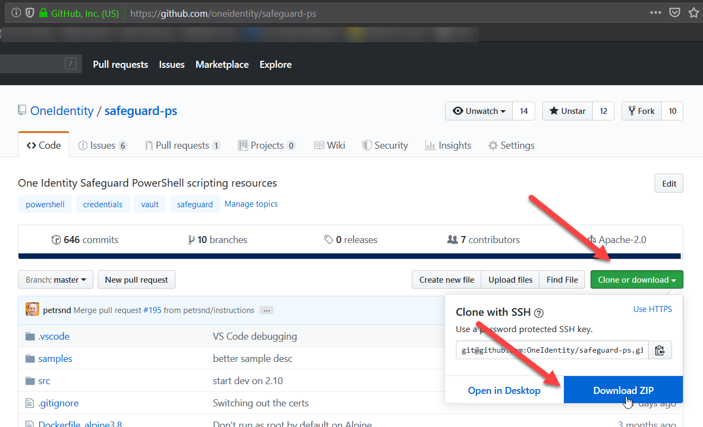

# safeguard-ps Hands-on Lab

## 1. Install safeguard-ps from the PowerShell Gallery

safeguard-ps is hosted on the PowerShell Gallery.

Open a browser, navigate to `powershellgallery.com`, and search for
`safeguard-ps`.


To install it, open your start menu and right click on PowerShell to select the
`Run as Administrator` option.

Installing safeguard-ps is a one-liner from a PowerShell command prompt:

```PowerShell
PS> Install-Module safeguard-ps
```

By default, the `Install-Module` cmdlet will find safeguard-ps in the
[PowerShell Gallery](https://www.powershellgallery.com/) and install it for all
users. This means you need to be running PowerShell as an administrator who can
install software for all users.

The installation process will prompt you as to whether you want to trust the
PowerShell Gallery, because it is not trusted by default. `¯\_(ツ)_/¯`

If running as administrator is not an option, you can install safeguard-ps just
for the current user by opening a normal PowerShell prompt and typing:

```PowerShell
PS> Install-Module safeguard-ps -Scope CurrentUser
```

The `Install-Module` cmdlet will install the latest stable version of
safeguard-ps. There is always a version of safeguard-ps released with a version
matching the first two number of the SPP version it was built to work with.

For example: `SPP 2.9`.0.10658 goes with `safeguard-ps 2.9`.379

At the same time that safeguard-ps 2.9 is out safeguard-ps 2.10.xxx-pre is also
already available.

You can install the latest prerelease of safeguard-ps by typing:

```PowerShell
PS> Install-Module safeguard-ps -AllowPrerelease
```

If this doesn't work for you, then you probably have the crummy version of
PowerShellGet that comes with Windows and you should replace it with the newer
open source version.

You can do this by typing:

```PowerShell
PS> Install-PackageProvider -Name NuGet -Force
PS> Install-Module PowerShellGet -Force
```

To install a specific version of safeguard-ps you can use a command similar to:

```PowerShell
PS> Install-Module safeguard-ps -RequiredVersion 2.8.349
```

## 2. Check out safeguard-ps using git command line

*If you are not interested in using git or checking out the code you can skip
this section*

Anyone can check out the safeguard-ps code from the OneIdentity/safeguard-ps
GitHub repository.

Open a PowerShell prompt and go to a directory where you want the code to be
downloaded:

```PowerShell
PS> git clone git@github.com:OneIdentity/safeguard-ps.git
```

This will check out safeguard-ps using the SSH protocol. You can check it out
unauthenticated because it is open source.

If you want to actively participate in contributing the safeguard-ps project,
you will want to create a GitHub account (for free) and create your own fork
of the project.


Then, you can make changes in your own git branch and create a pull request
back to the OneIdentity/safeguard-ps repository. Forking, branching, and
creating a pull request is beyond the scope of this lab.

## 3. Install safeguard-ps from GitHub by downloading a zip

If for whatever version you cannot get the `Install-Module` method to work to
install safeguard-ps, you can always just download the source from GitHub.

Open a browser and go to: `github.com/oneidentity/safeguard-ps`



Click on the `Clone or download` button and click on the `Download ZIP`.

Save the zip file and unzip it wherever you wish.

Once it is unzipped you can go into the `safeguard-ps` folder and type:

```PowerShell
PS> ./install-local.ps1
```

This will install the latest source with a `.99999` final version number so
that it will be preferred over any other safeguard-ps module that might be
installed in another location.

## 4. Connecting to the Safeguard API


## 5. Finding a cmdlet and getting help to call it


## 6. Creating assets and running management tasks


## 7. Checking out passwords and launching sessions


## 8. Getting a support bundle


## 9. Setting up certificates and calling A2A

